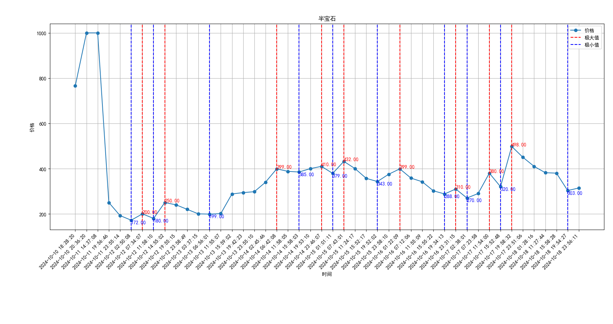

# CounterStrike is also CS
## Trade
### 交易须知
- 每天交易于**北京时间15:00**开启
- 每次获得的饰品或武器，需要在七天后的下午三点才能交易
### 通行证
#### 商品价格趋势

七天一览

半宝石

**10月10日15时（第一个交易日**是本次通行证开启后第一批商品可以交易的时间，从图像中可以发现在第一天商品的价格会炒的异常之高；

**10月11日 - 10月13日15时前（第二、三个交易日）**，由于第二批、第三批商品冷却器已过，货存增大，商品价格骤降，达到谷底是抄底的好时机；

**10月13日15时后（第四个交易日）**，商品价格迎来第二次上涨，在10月14日6时达到极值点；

**10月14日 - 10月16日15时前（第五、六个交易日）**，价格处在第二次高峰，适合第二批之后商品的交易；

**10月16日15时后 - 10月17日15时前（第七个交易日）**，价格再次下跌，在10月17日6时达到极小值点；

**10月17日15时后- 10月18日15时前（第八个交易日）**，第一批购入商品的冷却期结束，价格第三次上涨。

在仔细观察，可以发现早上7时左右和晚上12时左右时通常是价格的极大值点

